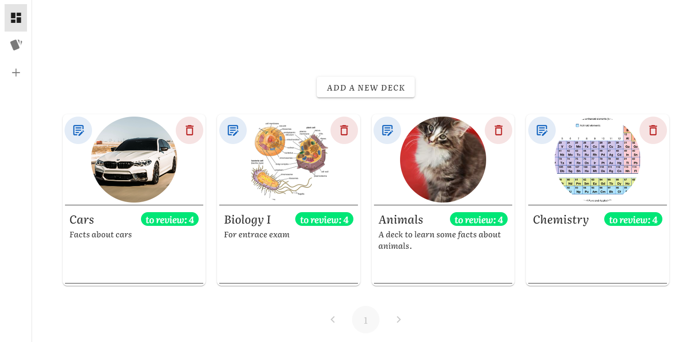
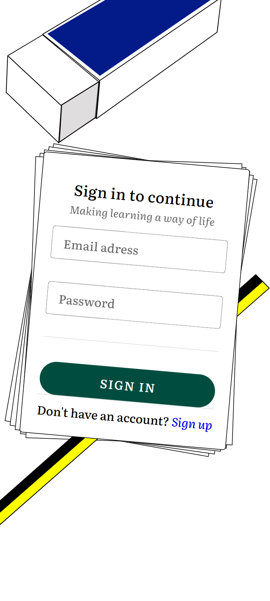
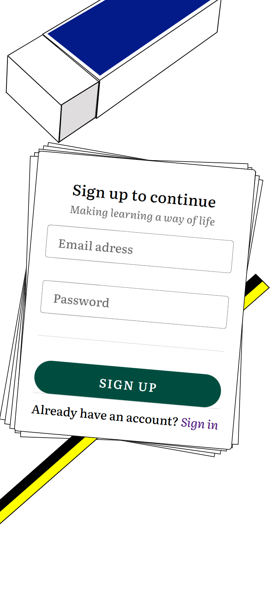
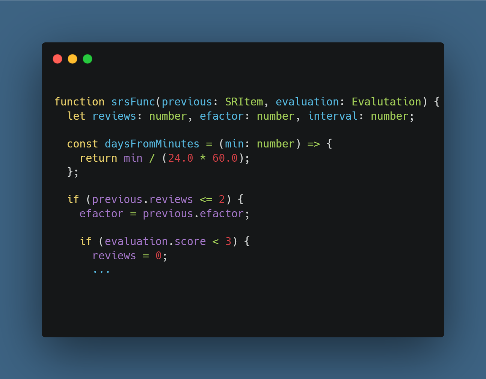

# RecallRhythm

**RecallRhythm** is an online platform that uses flashcards to facilitate learning and memorization of concepts. Create your own decks improve your skills in any subject.

[Click here to see the live demo](https://recallrhythm.netlify.app/#/)

This web application is written with Typescript. It uses Vue as frontend framework. The compilation process is done using Vite.

The Vuetify library provides a sleek and professional look for the UI, while Sass is used for CSS preprocessing.

With Supabase integration, this application can take advantage of a powerful and scalable database and an easy-to-use API to perform CRUD operations and store images.

## Features

### User auth

Using the supabasejs client my application ensures that sensitive data is stored securely and that only authenticated users can access restricted operations.

  
  

### Spaced repetition

I use a spaced repetition algorithm based on the one used by Anki but much less complex. This allows cards to be recalled for extended periods of time at the time the recall relapses.

  

## Future implementations

- Image optimization (maybe with Sharp).
- Skeleton loaders.
- User update page.

## Get started

To get started using **RecallRhythm**, you need to install:

- Node.js
- All the needed dependencies using <code>npm install</code> after cloning the repository

### Running the application

To run the application, use the following commands:

1. <code>npm run build</code>

2. <code>npm run preview</code>
